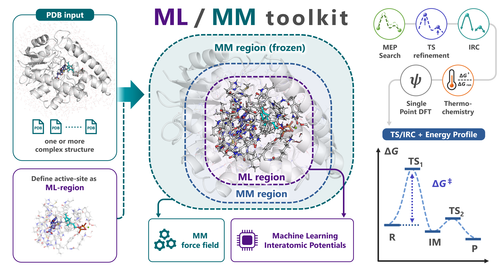

# **ML/MM toolkit** — Toward Accelerated Mechanistic Investigation of Enzymatic Reactions

## Overview



Quantum mechanics/molecular mechanics (QM/MM) methods have long been used to analyze enzymatic reaction mechanisms *in silico*. While treating the active site with QM and the remainder with MM reduces the computational cost, the inherently high cost of the QM calculation remains a major limitation. Replacing QM with Machine Learning (ML) interatomic potentials yields ML/MM approaches that further reduce computational cost while retaining accuracy.

**ML/MM toolkit** is an open-source command-line toolkit for ML/MM calculations. It streamlines the workflow necessary for enzymatic reaction mechanism analyses — energy minimization, transition-state (TS) search, and vibrational analysis — to calculate the reaction free energy (&Delta;G) and activation free energy (&Delta;G<sup>&ddagger;</sup>) for a given enzyme–substrate complex structure. A link atom boundary treatment is implemented to include amino-acid residues in the ML region, and full-system Hessians are available for TS searches and vibrational analyses. A microiteration scheme separates ML and MM degrees of freedom, enabling efficient TS optimization and Hessian-based methods for systems comprising around 10,000 atoms.

Each workflow step is also available as an [individual subcommand](#cli-subcommands) ([`opt`](docs/opt.md), [`scan`](docs/scan.md), [`scan2d`](docs/scan2d.md), [`path-search`](docs/path_search.md), [`tsopt`](docs/tsopt.md), [`freq`](docs/freq.md), [`irc`](docs/irc.md), [`dft`](docs/dft.md), [`energy-diagram`](docs/energy_diagram.md), [etc.](#cli-subcommands)), allowing fine-grained control over each stage. A **single command** can generate a first-pass enzymatic reaction path with ML/MM accuracy:

```bash
mlmm all -i R.pdb P.pdb -c PRE -l "PRE:-2"
```

The full workflow — **MEP search → TS optimization → IRC → thermochemistry → single-point DFT** — can be run in one command:

```bash
mlmm all -i R.pdb P.pdb -c PRE -l "PRE:-2" --tsopt --thermo --dft
```

Given **(i) two or more PDB files** (R → ... → P), **or (ii) one PDB with `--scan-lists`**, **or (iii) one TS candidate with `--tsopt`**, `mlmm_toolkit` automatically:

- extracts an **active-site pocket** around user-defined substrates,
- assigns **ONIOM regions** (ML / Movable MM / Frozen MM) via B-factor encoding,
- generates **MM parameters** (parm7/rst7) using AmberTools,
- explores **minimum-energy paths (MEPs)** with GSM,
- *optionally* optimizes **transition states**, runs **vibrational analysis**, **IRC**, and **single-point DFT**.

> **Important (prerequisites):**
> - Input PDB files must already contain **hydrogen atoms**.
> - When providing multiple PDBs, they must contain **the same atoms in the same order** (only coordinates may differ).
> - A **parm7 topology** file (AmberTools) is required for MM calculations; use `mlmm mm-parm` to generate one.

### Related tools

| Tool | Use case | Repository |
|------|----------|------------|
| **pdb2reaction** | CLI-based reaction mechanism analysis for cluster models and small molecules | <https://github.com/t-0hmura/pdb2reaction> |
| **UMA–Pysisyphus Interface** | YAML-input-based reaction mechanism analysis for small molecules | <https://github.com/t-0hmura/uma_pysis> |

`mlmm-toolkit` additionally automates MM force field generation and ML region assignment from a single PDB input — the `all` workflow requires only PDB files to run the full pipeline.

Both `mlmm-toolkit` and `pdb2reaction` include a custom GPU-optimized pysisyphus fork for geometry optimization, TS search, and IRC. This bundled fork is **not compatible** with the upstream pysisyphus package; do not install them side by side.

---

## Installation

### Quick install

For CUDA 12.6:
```bash
conda create -n mlmm python=3.11 -y
conda activate mlmm
conda install -c conda-forge ambertools pdbfixer -y

pip install torch==2.6.0 --index-url https://download.pytorch.org/whl/cu126
pip install mlmm-toolkit
huggingface-cli login
```

For CUDA 12.9 (recommended for RTX 50 series):
```bash
conda create -n mlmm python=3.11 -y
conda activate mlmm
conda install -c conda-forge ambertools pdbfixer -y

pip install torch==2.8.0 --index-url https://download.pytorch.org/whl/cu129
pip install mlmm-toolkit
huggingface-cli login
```

> **Previous version:** v0.2.0 introduced breaking changes to the CLI interface and Hessian handling.
> To install the previous stable release (v0.1.1) from GitHub:
>
> ```bash
> pip install git+https://github.com/t-0hmura/mlmm_toolkit.git@v0.1.1
> ```

### Prerequisites

| Requirement | Notes |
|-------------|-------|
| **Python >= 3.11** | 3.12 also supported |
| **CUDA runtime >= 12.6** | CUDA 12.9 recommended for RTX 50 series |
| Linux / WSL 2 | — |

### Full setup (conda)

```bash
conda create -n mlmm python=3.11 -y
conda activate mlmm
conda install -c conda-forge ambertools pdbfixer -y

pip install torch==2.8.0 --index-url https://download.pytorch.org/whl/cu129
pip install mlmm-toolkit
plotly_get_chrome -y
huggingface-cli login
```

If you are on an HPC cluster that uses *environment modules*, load CUDA **before** installing PyTorch:

```bash
module load cuda/12.6
```

> `fairchem-core` is a core dependency. `aimnet2` and other ML backends (`orb-models`, `mace-torch`) are optional extras (e.g. `pip install "mlmm-toolkit[aimnet2]"`).


### DFT single-point (`mlmm dft`)

DFT dependencies are **not** installed by default. To use `mlmm dft`, install the `[dft]` extra:

```bash
pip install "mlmm-toolkit[dft]"
```

This installs PySCF, GPU4PySCF (x86_64 only), and related CUDA libraries. Note that DFT single-point calculations are practical only for systems up to **~500 atoms** in the ML region; larger systems will require prohibitive compute time and memory.

### Avoid AmberTools conflicts (optional)

If `AmberTools` is loaded, unload it before installing to prevent conflicts for **ParmEd**:

```bash
module unload amber
```

### For DMF method

```bash
conda install -c conda-forge cyipopt -y
```

### Authenticate for UMA (Hugging Face)

UMA model weights are on Hugging Face Hub. You need to log in once (see <https://github.com/facebookresearch/fairchem>):

```bash
huggingface-cli login
```

### Supported ML potentials

| Potential | Repository | Install extra |
|-----------|------------|---------------|
| **UMA** (default) | <https://github.com/facebookresearch/fairchem> | *(included)* |
| **ORB** | <https://github.com/orbital-materials/orb-models> | `pip install "mlmm-toolkit[orb]"` |
| **MACE** | <https://github.com/ACEsuit/mace> | see note below |
| **AIMNet2** | <https://github.com/isayevlab/aimnetcentral> | `pip install "mlmm-toolkit[aimnet2]"` |

> **Note:** MACE and UMA cannot coexist due to conflicting `e3nn` versions (`fairchem-core` requires `e3nn>=0.5`, `mace-torch` requires `e3nn==0.4.4`). To use MACE, uninstall `fairchem-core` first:
> ```bash
> pip uninstall fairchem-core
> pip install mace-torch
> ```
> This means UMA will no longer be available in that environment. We recommend using a **separate conda environment** for MACE.

---

## Preparing an Enzyme–Substrate System

1. **Build a structural model of the complex.**
   Download coordinates from Protein Data Bank. If an experimental structure is not available, use structure prediction programs such as **AlphaFold3**, docking simulation programs, or GUI software such as **PyMOL**.

2. **Generate parameter/topology and coordinate files.**
   Create `.pdb`, `.parm7`, and `.rst7` files of the complex (see the [OpenMM tutorial](https://openmm.github.io/openmm-cookbook/latest/tutorials)).
   To mimic aqueous conditions, solvate the complex, then remove water molecules beyond ~6 Å.
   > Note: elemental information (columns 77–78) is omitted in PDB files generated by tleap. Use [`mlmm add-elem-info`](docs/add_elem_info.md) to fix this.

3. **Define the ML region.**
   Use [`mlmm extract`](docs/extract.md) or any molecular viewer to select residues around the substrate:

   ```bash
   mlmm extract -i complex.pdb -c PRE -r 6.0 -l "PRE:-2" -o ml_region.pdb
   ```

   **Important:** atom order, residue names, and residue numbers must match between the *full* PDB and the *ML-region* PDB. (In PyMOL, tick **"Original atom order"** when exporting.)

---

## Quick Examples

### Full workflow (multi-structure)
```bash
mlmm all -i R.pdb P.pdb -c PRE -l "PRE:-2" \
    --tsopt --thermo --dft
```

### Scan mode (single structure)
```bash
mlmm all -i R.pdb -c PRE -l "PRE:-2" \
    --scan-lists "[('PRE 353 O1\'','PRE 353 C3',1.2)]"
```

### TS optimization only
```bash
mlmm tsopt -i TS_candidate_layered.pdb --parm complex.parm7 \
    -q 1 --opt-mode light
```

### Step-by-step workflow
```bash
# 1. Generate MM parameters
mlmm mm-parm -i complex.pdb -l "PRE:-2"

# 2. Extract active-site pocket
mlmm extract -i complex.pdb -c '353' -l "PRE:-2" -r 6.0

# 3. Assign 3-layer ONIOM regions
mlmm define-layer -i complex.pdb --model-pdb pocket.pdb --radius-freeze 10.0

# 4. Optimize geometry
mlmm opt -i complex_layered.pdb --parm complex.parm7 -q 1 --opt-mode heavy

# 5. MEP search
mlmm path-search -i R_layered.pdb P_layered.pdb --parm complex.parm7 -q 1

# 6. TS optimization
mlmm tsopt -i hei.pdb --parm complex.parm7 -q 1 --opt-mode light

# 7. Frequency analysis
mlmm freq -i ts_optimized.pdb --parm complex.parm7 -q 1

# 8. IRC
mlmm irc -i ts_optimized.pdb --parm complex.parm7 -q 1

# 9. DFT single-point
mlmm dft -i optimized.pdb --parm complex.parm7 -q 1
```

Fully working example scripts are provided in the [`examples/`](examples/) directory.
Start with the minimal [`examples/toy_system/`](examples/toy_system/) example, then explore a realistic enzyme case in [`examples/methyltransferase/`](examples/methyltransferase/).

---

## CLI Subcommands

### Workflow

| Subcommand | Role | Documentation |
|---|---|---|
| `all` | End-to-end: extraction → MEP → TS → IRC → freq → DFT | [docs/all.md](docs/all.md) |

### Structure Preparation

| Subcommand | Role | Documentation |
|---|---|---|
| `mm-parm` | Generate parm7/rst7 topology via AmberTools | [docs/mm_parm.md](docs/mm_parm.md) |
| `extract` | Extract active-site pocket (cluster model) | [docs/extract.md](docs/extract.md) |
| `define-layer` | Assign 3-layer B-factor encoding | [docs/define_layer.md](docs/define_layer.md) |
| `add-elem-info` | Add/repair PDB element columns (77-78) | [docs/add_elem_info.md](docs/add_elem_info.md) |
| `fix-altloc` | Resolve alternate conformations | [docs/fix_altloc.md](docs/fix_altloc.md) |

### Optimization & Path Search

| Subcommand | Role | Documentation |
|---|---|---|
| `opt` | Geometry optimization (L-BFGS or RFO) | [docs/opt.md](docs/opt.md) |
| `tsopt` | TS optimization (Dimer or RS-I-RFO) | [docs/tsopt.md](docs/tsopt.md) |
| `path-opt` | MEP optimization via GSM or DMF | [docs/path_opt.md](docs/path_opt.md) |
| `path-search` | Recursive MEP search with refinement | [docs/path_search.md](docs/path_search.md) |
| `scan` | 1D bond-length driven scan | [docs/scan.md](docs/scan.md) |
| `scan2d` | 2D distance grid scan | [docs/scan2d.md](docs/scan2d.md) |
| `scan3d` | 3D distance grid scan | [docs/scan3d.md](docs/scan3d.md) |

### Analysis

| Subcommand | Role | Documentation |
|---|---|---|
| `freq` | Vibrational frequency analysis + thermochemistry | [docs/freq.md](docs/freq.md) |
| `irc` | IRC calculation (EulerPC) | [docs/irc.md](docs/irc.md) |
| `dft` | Single-point DFT (GPU4PySCF / PySCF) | [docs/dft.md](docs/dft.md) |

### Visualization & Export

| Subcommand | Role | Documentation |
|---|---|---|
| `trj2fig` | Energy plot from XYZ trajectory | [docs/trj2fig.md](docs/trj2fig.md) |
| `energy-diagram` | Energy diagram from numeric values | [docs/energy_diagram.md](docs/energy_diagram.md) |
| `oniom-export` | Generate Gaussian ONIOM / ORCA QM/MM input | [docs/oniom_export.md](docs/oniom_export.md) |
| `oniom-import` | Import ONIOM input and reconstruct XYZ/layered PDB | [docs/oniom_import.md](docs/oniom_import.md) |

---

## 3-Layer ONIOM System

`mlmm_toolkit` uses a 3-layer system encoded in PDB B-factor columns:

| Layer | B-factor | Description | Hessian |
|---|---|---|---|
| ML | 0.0 | Active site (UMA energy/force/Hessian) | Yes |
| Movable MM | 10.0 | MM atoms allowed to move | No (by B-factor alone) |
| Frozen | 20.0 | Distant protein (coordinates fixed) | No |

Covalent bonds cut at the ML/MM boundary are capped with hydrogen *link atoms*.
The ML region can therefore include entire amino-acid side chains when necessary.

Use [`mlmm define-layer`](docs/define_layer.md) to assign layers automatically based on a model PDB (the ML region).

The MM layer uses an analytical Hessian force field (`hessian_ff`) by default. Any force field capable of generating Amber parameters (e.g., ff19SB + OPC3 + GAFF2) can be used.

---

## Units

| Interface | Energy | Distance | Force | Hessian |
|---|---|---|---|---|
| **Core & ASE** | eV | Å | eV Å<sup>-1</sup> | eV Å<sup>-2</sup> |
| **PySisyphus (CLI)** | Hartree | Bohr | Ha Bohr<sup>-1</sup> | Ha Bohr<sup>-2</sup> |

Unit conversions are handled automatically inside the ML/MM calculator.

---

## Python API

See [Python API Reference](docs/mlmm_calc.md) for full documentation.

An **ASE** interface is available for Python scripting.

### MLMMCore (Base-Level)

```python
from mlmm_toolkit.mlmm_calc import MLMMCore

core = MLMMCore(
    input_pdb    = "complex.pdb",    # Full system PDB (protein + substrate + solvent)
    real_parm7   = "complex.parm7",  # Amber topology for the full system
    model_pdb    = "ml_region.pdb",  # ML region only (trimmed PDB)
    model_charge = -1,               # Formal charge of the ML region including link H atoms
    model_mult   = 1,                # Spin multiplicity of the ML region
)

from ase.io import read
atoms = read("structure.pdb")
results = core.compute(atoms.get_positions(), return_forces=True, return_hessian=True)

energy  = results["energy"]    # float, eV
forces  = results["forces"]    # ndarray (N, 3), eV/Å
hessian = results["hessian"]   # torch.Tensor (3N, 3N), eV/Å^2
```

### ASE Interface

```python
from mlmm_toolkit.mlmm_calc import MLMMASECalculator

atoms.calc = MLMMASECalculator(
    input_pdb="complex.pdb", real_parm7="complex.parm7",
    model_pdb="ml_region.pdb", model_charge=-1, model_mult=1,
)
energy = atoms.get_potential_energy()  # eV
```

> **Notes**
> - `complex.pdb` is the reference PDB used when the Amber parameters were generated, whereas `structure.pdb` can contain any starting geometry.
> - If `model_charge` is omitted, it defaults to **0**. Always set it explicitly for charged systems.
> - The bundled pysisyphus fork is used internally by the CLI. It is **not compatible** with the upstream `pysisyphus` package and should not be imported directly by user scripts.

---

## Getting Help

```bash
mlmm --help
mlmm <subcommand> --help
mlmm <subcommand> --help-advanced
```

`--help` shows core options. `--help-advanced` shows the full option list including advanced parameters.

---

## Documentation

- [**Getting Started**](docs/getting_started.md) — Installation and first steps
- [**Concepts**](docs/concepts.md) — 3-layer system, ONIOM, link atoms
- [**CLI Command Reference**](docs/reference/commands/index.md)
- [**YAML Schema**](docs/reference/yaml.md)
- [**Troubleshooting**](docs/troubleshooting.md) — Common errors and fixes
- **Full command index**: [docs/index.md](docs/index.md)

---

## References

[1] Ohmura, T., Inoue, S., Terada, T. (2025). ML/MM toolkit -- Towards Accelerated Mechanistic Investigation of Enzymatic Reactions. ChemRxiv. https://doi.org/10.26434/chemrxiv-2025-jft1k
[2] Wood, B. M. et al. (2025). UMA: A Family of Universal Models for Atoms. http://arxiv.org/abs/2506.23971
[3] Steinmetzer, J. et al. (2021). pysisyphus: Exploring potential energy surfaces in ground and excited states. *Int. J. Quantum Chem.*, 121(3). https://doi.org/10.1002/qua.26390

---

## License

**ML/MM toolkit** is distributed under the **GNU General Public License version 3 (GPL-3.0)**.

***This software is still under development. Please use it at your own risk.***
