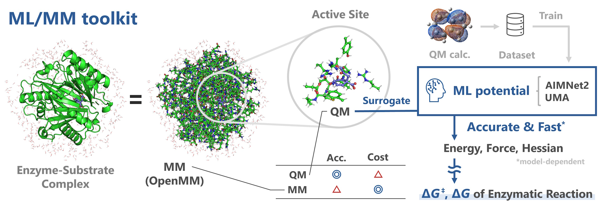

# **ML/MM toolkit** — Toward Accelerated Mechanistic Investigation of Enzymatic Reactions

## Overview

  

Quantum mechanics/molecular mechanics (QM/MM) methods have long been used to analyze enzymatic reaction mechanisms *in silico*. While treating the active site with QM and the remainder with MM reduces the computational cost, the inherently high computational cost of the QM calculation is still a major limitation for their application to a wide variety of enzymes. Replacing QM with machine-learning (ML) interatomic potentials yields ML/MM approaches that can further reduce computational cost while retaining accuracy.

Here, we present **ML/MM toolkit**, an open-source command-line toolkit for ML/MM calculations that employs that employs AIMNet2 or UMA potentials. This toolkit streamlines the workflow necessary for the enzymatic reaction mechanism analyses such as energy minimization, transition-state (TS) search, and vibrational analysis to calculate the reaction free energy ($\Delta G$) and activation free energy ($\Delta G^{\ddagger}$) for a given enzyme–substrate complex structure. A link atom boundary treatment is implemented to include amino‑acid residues in the ML region and full-system Hessians are available for TS searches and vibrational analyses. To accelerate TS searches in systems comprising  around 10,000  atoms, we developed a *Partial Hessian Guided Dimer (PHG-Dimer)* method that uses the active-site Hessian to determine initial dimer orientation. We also integrated a mass‑scaled flattening loop to suppress spurious imaginary modes. Collectively, the ML/MM toolkit makes enzymatic mechanistic investigations more accessible.

> **UMA‑only workflow**   
> If you wish to perform chemical‑reaction‑mechanism analysis using **UMA alone** (without the ML/MM hybrid layer), a dedicated **UMA – PySisyphus Interface** is available at https://github.com/t-0hmura/uma_pysis.
---

This package provides a **machine‑learning / molecular‑mechanics (ML/MM) hybrid calculator** and surrounding **CLI toolsets** that enable you to get **$\Delta G$ and $\Delta G^{\ddagger}$ of Enzymatic Reaction** from Protein-Substrate complex structure easily.  
By combining a machine‑learning interatomic potential with classical force fields, it enables efficient calculation of very large systems such as proteins and enzyme‑substrate complexes.

This calculator provides:

* **Energies**  
* **Forces**  
* **Hessians** – ***Analytical*** in the ML region, ***Numerical*** or ***0-padded*** in the MM region  

Covalent bonds cut at the QM/MM boundary are capped with hydrogen *link atoms*.  
The ML region can therefore include entire amino‑acid side chains when necessary.

### Supported ML potentials

| Potential | Repository |
|-----------|------------|
| **AIMNet2** | <https://github.com/isayevlab/aimnetcentral> |
| **UMA** | <https://github.com/facebookresearch/fairchem> |

The MM layer uses **OpenMM**. Any force field capable of generating parameters (e.g., AMBER ff14SB + TIP3P + GAFF2) can be used.

Interfaces are available for **ASE** and **Pysisyphus**.  
Periodic boundary conditions & implementation for molecular dynamics are planned for future releases but are *not* yet implemented.

> You can select UMA models from `uma_model` parameter.

***This software is still under development. Please use it with care.***

## 1. Installation Guide

### Quick install

For CUDA 12.6:
```bash
pip install fairchem-core
pip install git+https://github.com/isayevlab/aimnetcentral.git
pip install git+https://github.com/t-0hmura/mlmm_toolkit.git
huggingface-cli login
```

For CUDA 12.8 (required for RTX 50 series):
```bash
pip install fairchem-core
pip install git+https://github.com/isayevlab/aimnetcentral.git
pip install --force-reinstall torch==2.7.0 --index-url https://download.pytorch.org/whl/cu128
pip install git+https://github.com/t-0hmura/mlmm_toolkit.git
huggingface-cli login
```

---

### 1.1. Prerequisites

| Requirement | Notes |
|-------------|-------|
| **Python 3.11** | Any distribution is fine. Conda or Docker is a convenient choice for easy handling. |
| **CUDA runtime ≥ 12.6** | CUDA 12.8 is required for RTX 50 series. |
| Linux / WSL 2 | – |

### 1.2. (Optional) Create a conda environment

Skip this block if you already manage Python another way. Replace **`mlmm`** with any name you like.

```bash
conda create -n mlmm python=3.11 -y
conda activate mlmm
```

### 1.3. Install PyTorch

Choose the wheel that matches your CUDA driver:

```bash
# --- CUDA 12.6 ---
pip install torch==2.6.0 --index-url https://download.pytorch.org/whl/cu126

# --- CUDA 12.8 (required for RTX 50 series) ---
pip install torch==2.7.0 --index-url https://download.pytorch.org/whl/cu128
```

If you are on an HPC cluster that uses *environment modules*, load CUDA **before** installing PyTorch, like this:

```bash
module load cuda/12.6
```

### 1.4. Install ML/MM toolkit

Choose one of the following backends:

* **AIMNet2 only**
  ```bash
  pip install git+https://github.com/isayevlab/aimnetcentral.git
  pip install git+https://github.com/t-0hmura/mlmm_toolkit.git
  ```

* **UMA only**
  ```bash
  pip install fairchem-core
  # pip install --force-reinstall torch==2.7.0 --index-url https://download.pytorch.org/whl/cu128 # for CUDA 12.8
  pip install git+https://github.com/t-0hmura/mlmm_toolkit.git
  ```

* **Both backends** *(order matters)*
  ```bash
  pip install fairchem-core
  pip install git+https://github.com/isayevlab/aimnetcentral.git
  # pip install --force-reinstall torch==2.7.0 --index-url https://download.pytorch.org/whl/cu128 # for CUDA 12.8
  pip install git+https://github.com/t-0hmura/mlmm_toolkit.git
  ```

> **Why this order?**  
> Pysisyphus depends on numpy < 2.0 (a constraint inherited from ASE ≥ 3.25); if you install fairchem after AIMNet2, it will try to upgrade NumPy (and potentially SymPy and other libraries), creating version conflicts.  
> The sequence above avoids conflicting pins. You may see *warning* messages, but the installation is still functional.  
> Once both backends are present **and** you require CUDA 12.8, reinstall PyTorch so that the wheel version matches your driver (FairChem currently pulls `torch‑2.6`).

### 1.5. Authenticate for UMA (Hugging Face)

UMA model is on Hugging Face Hub. You need to log in once (See https://github.com/facebookresearch/fairchem):

```bash
huggingface-cli login
```

### 1.6. Avoid AmberTools conflicts (optional)

If `AmberTools` is loaded, unload it before installing to prevent conflict for **ParmEd**, as in:

```bash
module unload amber
```

## 2. Preparing an Enzyme–Substrate System

1. **Build a structural model of the complex.**  
   Download the coordinates of the experimental structure of the complex from Protein Data Bank. If experimental structure is not available, you can predict its structure using complex structure prediction programs such as **AlphaFold3** or docking simulation programs, or manually model it with GUI software such as **PyMOL**. 

2. **Generate parameter/topology and coordinate files**  
   Create `.pdb`, `.parm7`, and `.rst7` files of the complex (see the OpenMM tutorial at https://openmm.github.io/openmm-cookbook/latest/tutorials).
   To mimic aqueous conditions, the complex should be solvated, and water molecules located beyond about 6 Å from the complex should be removed to reduce computational cost.  
   > Note that elemental information (column 77-78) is omitted in the pdb file when you use tleap. Use `add_elem_info` after tleap.  

3. **Define the ML region.**  
   Use the bundled CLI tool **`def_ml_region`** (installed automatically and appears in `$PATH`) or any molecular viewer.  
   Example: select residues within 6 Å of the substrate and write the result to `output_ml_region.pdb`:

   ```bash
   def_ml_region -r input_complex.pdb -c input_substrate.pdb -o output_ml_region.pdb\
    --radius_ml 6.0 --include_H2O false --exclude_backbone true
   ```

   **Options**  
   - `--include_H2O true` → include nearby water molecules.  
   - `--exclude_backbone true` → extract side‑chains only (omit backbone).

   **Important:** atom order, residue names, and residue numbers must match between the *full* PDB and the *ML‑region* PDB. (If you use PyMOL, tick **“Original atom order”** when exporting the molecule.)


## 3. Using the Calculator

The ML/MM calculator implemented in ML/MM toolkit offers interfaces for **ASE** and **Pysisyphus**. When using Pysisyphus, we recommend the partially GPU-enabled version that is installed automatically alongside `mlmm_toolkit`.

> If you need the calculation to be deterministic and your VRAM is ample, set both `ml_device` and `mm_device` to `cuda`, and, in the Pysisyphus interface, set `H_double` to `true`.

### Quick‑start examples.
Fully working scripts are provided in the `examples/` directory so you can try the calculator straight away. Start with the minimal `toy_system` example, then explore realistic enzyme cases in `chorismate_mutase` and `methyltransferase`. Inside `examples/toy_system/`, running `bash run.sh` executes a short calculator test. For a step‑by‑step walkthrough of an entire reaction‑energy profile—from structure preparation to $\Delta G^{\ddagger}$ evaluation—see [examples/tutorial.md](examples/tutorial.md).

### Units at a glance

| Interface       | Energy | Distance | Force        | Hessian        |
|-----------------|--------|----------|--------------|----------------|
| **Core & ASE**  | eV     | Å        | eV Å<sup>-1</sup>       | eV Å<sup>-2</sup>         |
| **Pysisyphus**  | Hartree| Bohr     | Ha Bohr<sup>-1</sup>    | Ha Bohr<sup>-2</sup>      |


### 3.1 Example for ASE Interface: <https://wiki.fysik.dtu.dk/ase>

```python
from ase.io import read, write
from ase.optimize import LBFGS
from mlmm import mlmm_ase          # ASE wrapper

mlmm_kwargs = dict(
    real_pdb     = "complex.pdb",
    real_parm7   = "complex.parm7",
    real_rst7    = "complex.rst7",
    model_pdb    = "ml_region.pdb",
    model_charge = -1,             # Charge of ML region including link atoms
    model_mult   = 1,              # Multiplicity of ML region
    backend      = "uma",          # "uma" or "aimnet2"
    uma_model    = "uma-s-1p1",
    ml_device    = "auto",         # "auto" | "cuda" | "cpu"
    ml_cuda_idx  = 0,
    mm_device    = "cpu",
    mm_cuda_idx  = 0,
    mm_threads   = 16,
)

atoms = read("structure.pdb")
atoms.calc = mlmm_ase(**mlmm_kwargs)

opt = LBFGS(atoms, logfile="opt.log")
opt.run(fmax=0.02, steps=10000)

write("final.pdb", atoms)
```

> **Notes**  
> • `complex.pdb` is the reference pdb used when the Amber parameters were generated, whereas `structure.pdb` can contain any starting geometry.  
> • If `model_charge` or `model_mult` is omitted, the charge is estimated with **RDKit**, and the multiplicity defaults to 1 — set them explicitly for safety.  
> • `model_mult` is available with `uma` backend.  
> • `ml_device="auto"` selects a CUDA-capable GPU automatically (the first available one).

### 3.2 Example for Pysisyphus Interface: <https://pysisyphus.readthedocs.io>

#### (a) Direct API

```python
from pysisyphus.io.pdb import geom_from_pdb
from pysisyphus.optimizers.LBFGS import LBFGS
from mlmm import mlmm            # Pysisyphus calculator

mlmm_kwargs = dict(
    real_pdb     = "complex.pdb",
    real_parm7   = "complex.parm7",
    real_rst7    = "complex.rst7",
    model_pdb    = "ml_region.pdb",
    model_charge = -1,
    model_mult   = 1,
    backend      = "aimnet2",
    ml_device    = "auto",
    ml_cuda_idx  = 0,
    mm_device    = "cpu",
    mm_cuda_idx  = 0,
    mm_threads   = 16,
    mem          = 10000, # MB – Pysisyphus scratch memory (If it is large, it is automatically reduced.)
)

geom = geom_from_pdb("structure.pdb")
geom.set_calculator(mlmm(**mlmm_kwargs))

opt = LBFGS(geom, max_cycles=10000, thresh='gau')
opt.run()

with open("final.xyz", "w") as fp:
    fp.write(geom.as_xyz() + "\n")
```

#### (b) Command‑Line via YAML input

```yaml
geom:
  type: cart
  fn: structure.pdb
opt:
  type: lbfgs
  thresh: gau
  max_cycles: 10000
  do_hess: false           # do not request a Hessian at the end
  dump: false              # do not output trajectory
calc:
  type: mlmm
  real_pdb: complex.pdb
  real_parm7: complex.parm7
  real_rst7: complex.rst7
  model_pdb: ml_region.pdb
  model_charge: -1
  model_mult: 1
  backend: uma
  uma_model: uma-s-1p1
  vib_run: false           # whether to do a frequency analysis
  out_hess_torch: false    # return Hessian as torch.Tensor on device when true
  H_double: false          # calculate and return Hessian as float64 when true, else float32
  ml_device: 'auto'
  ml_cuda_idx: 0
  mm_device: 'cpu'
  mm_cuda_idx: 0
  mm_threads: 16
  mem: 10000 # MB – Pysisyphus scratch memory (If it is large, it is automatically reduced.)
```

Run with:

```bash
mlmm input.yaml
```

### 3.3 Base‑Level API

```python
from mlmm import MLMMCore

core = MLMMCore(
    real_pdb       = "complex.pdb",    # Full system PDB (protein + substrate + solvent)
    real_parm7     = "complex.parm7",  # Amber topology for the full system
    real_rst7      = "complex.rst7",   # Amber coordinates for the full system
    model_pdb      = "ml_region.pdb",  # ML region only (trimmed PDB)
    model_charge   = -1,               # Formal charge of the ML region including link H atoms
    model_mult     = 1,                # Spin multiplicity of the ML region (used by UMA only)
    link_mlmm      = None,             # default: None, link atom pairs are auto determined.
    backend        = "uma",            # ML backend: "uma" or "aimnet2"
    uma_model      = "uma-s-1p1",      # Model name for uma backend.
    uma_task_name  = "omol",           # See document of fairchem. Default is 'omol', and it is generally best to leave it unchanged.
    vib_run        = True,             # Whether to compute numerical Hessian (True = finite difference)
    ml_device      = "auto",           # ML backend device: "auto", "cuda", or "cpu"
    ml_cuda_idx    = 0,                # GPU index for ML backend (if using CUDA)
    mm_device      = "cpu",            # MM backend device: "auto", "cuda", or "cpu"
    mm_cuda_idx    = 0,                # GPU index for MM backend (if using CUDA)
    mm_threads     = 16,               # Number of CPU threads for MM force evaluation
)

from ase.io import read; atoms = read("structure.pdb")
coord_ang = atoms.get_positions()

# Coordinates in Å, shape (N, 3) NumPy array
results = core.compute(coord_ang, return_forces=True, return_hessian=True)

energy   = results["energy"]       # float, eV
forces   = results["forces"]       # ndarray (N, 3), eV Å-1
hessian  = results["hessian"]      # torch.Tensor (3N, 3N), eV Å-2
```

### 3.4 Command‑Line Utilities

ML/MM toolkit ships with a small set of single‑purpose command‑line helpers. All tools are installed automatically when you install this package and therefore become available on your `$PATH`.

| Tool | Purpose | Typical use‑case |
|------|---------|------------------|
| `def_ml_region` | Build an ML region with residues around one or more substrate in a protein–substrate complex. | Preparing the subsystem for ML/MM calculation |
| `xyz_geom2pdb`  | Convert an XYZ geometry or trajectory to a multi‑model PDB while borrowing atom / residue metadata from a reference PDB. | Exporting Pysisyphus‑ or ASE‑optimized coordinates so that they can be visualized in PyMOL, VMD, Chimera X, etc. |
| `add_elem_info` | Append element symbols (PDB columns 77–78) | Fixing element fields after running external tools omit them, e.g. Amber’s `tleap`. |
| `get_freeze_indices` | List atom indices (0-based) to *freeze*  based on their distance from the ML region. | Constraining outer‑shell atoms to speed up local relaxations. |
| `bond_scan` | Scan a bond length with ML/MM optimization at each step. | Generating pre‑aligned structures along a reaction coordinate. |
| `ts_search` | Dimer‑based TS search with partial Hessian updates. | Locating transition states in large systems. |
| `energy_summary` | Compute ΔE/ΔG tables and plots from reactant, TS and product structures. | Summarizing reaction energetics. |
| `trj2fig` | Plot ΔE from an XYZ trajectory and export the highest peak frame. | Visualizing optimization or scan profiles. |

Detailed option tables and usage examples for each utility are provided in [docs/cli_doc.md](docs/cli_doc.md).

## License

**ML/MM toolkit** is distributed under the **GNU General Public License version 3 (GPL-3.0)** because some of its command-line (CLI) utilities depend on Pysisyphus.

## Citation
If you find this work helpful for your research, please cite:  
*Detailed methodological notes and benchmarks will be released shortly on **ChemRxiv**.*
