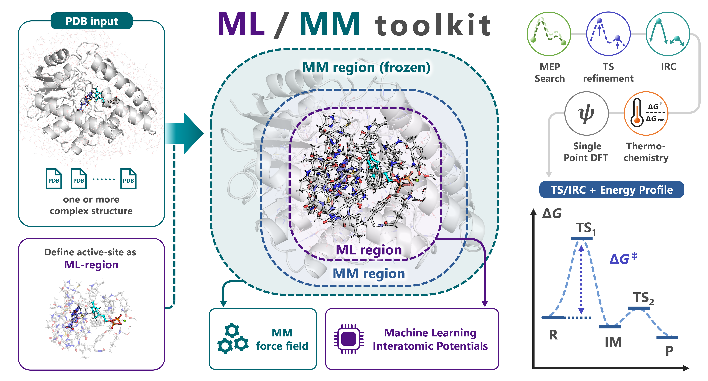

# Getting Started

## Overview



`mlmm-toolkit` is a Python CLI for analyzing enzymatic reactions with the multi-layer ONIOM (Our own N-layered Integrated molecular Orbital and molecular Mechanics) scheme, here in an ML/MM (machine learning / molecular mechanics) variant.

Instead of the quantum-mechanical (QM) region of conventional QM/MM, it uses a machine-learning interatomic potential (MLIP) for the reactive core — default UMA, with `orb` / `mace` / `aimnet2` selectable via `-b`. The surrounding protein is treated with mlmm-toolkit's bundled Amber force field.

The layers are combined by the ONIOM decomposition:

```
E_total = E_REAL_low + E_MODEL_high - E_MODEL_low
```

A single command generates an initial reaction path:

```bash
mlmm all -i R.pdb P.pdb -c 'SAM,GPP' -l 'SAM:1,GPP:-3'                  # MEP only
mlmm all -i R.pdb P.pdb -c 'SAM,GPP' -l 'SAM:1,GPP:-3' --tsopt --thermo --dft   # full
```

`mlmm all` accepts input in one of three ways:

- (i) ≥ 2 PDBs (R → ... → P),
- (ii) one PDB with `--scan-lists`, or
- (iii) one transition-state (TS) candidate with `--tsopt`.

From that input it defines the ML region, runs `mm-parm` + `define-layer`, and performs a minimum-energy-path (MEP) search with the growing string method (GSM, default) or Direct Max Flux (DMF). It then optionally chains TS optimization, intrinsic reaction coordinate (IRC), thermochemical correction, and single-point DFT.

```{important}
- Input PDBs must already contain **hydrogen atoms**. The "Input prep checklist" below covers the common pitfalls.
- Multiple PDBs must share the same atoms in the same order (only coordinates differ).
- Per-stage ML/MM subcommands require `--parm`; ML membership is supplied by `--model-pdb`, `--model-indices`, or a valid B-factor layer assignment. `mlmm all` can generate these inputs automatically.
```

For background concepts (3-layer system, link atoms, microiteration, units), read [Concepts & Workflow](concepts.md). For symptom-first diagnosis, jump to [Troubleshooting](troubleshooting.md) or [Common Error Recipes](recipes-common-errors.md).

### Interactive Colab GUI

[Open the mlmm Colab notebook](https://colab.research.google.com/github/t-0hmura/mlmm_toolkit/blob/main/examples/mlmm_colab.ipynb) to upload PDB/mmCIF structures and a matching full-system `parm7`, select the ML region in 3D, validate the generated command, run it, and inspect only the current invocation's results. Each user runs in a separate GPU runtime. MACE and ORB need no model login; UMA requires Hugging Face access, and switching between incompatible backends requires a runtime restart. DFT controls appear only when the DFT extra is selected in Setup. Setup installs the exact pinned PyPI wheel and fetches examples from the matching Git tag, so the production notebook becomes runnable after that wheel is published.

### CLI conventions

| Convention | Example |
|---|---|
| Residue selector | `'SAM,GPP'` or `'A:123,B:456'` |
| Charge mapping | `-l 'SAM:1,GPP:-3'` |
| Atom selector | `'TYR,285,CA'` or `'TYR 285 CA'` |

Full table: [CLI Conventions](cli-conventions.md).

### Input prep checklist

- **Hydrogens present.** `mlmm` does not auto-protonate. Add with AmberTools `reduce`, OpenMM `Modeller.addHydrogens`, `pdb2pqr --ff=AMBER`, Open Babel `obabel -h`, or `mlmm mm-parm --add-h` (PDBFixer wrapper). Apply the same tool to every input to keep atom order consistent.
- **Match `-l RES:CHARGE` to the H count actually in the file** (e.g. SAM with 23 H = `SAM:1` cation, 22 H = `SAM:0` neutral). Mismatch breaks `antechamber` with an odd-electron sqm failure — do not re-protonate "to look canonical".
- **R/P atom order must match.** In PyMOL, tick *Original atom order* on export.
- **Chain boundaries need `TER` records** when automatic insertion is disabled; the default `mm-parm --add-ter` preprocessing inserts chain and disconnected-peptide separators.
- **Charge scope**: in both `mlmm all` and per-stage commands, `-q/--charge` is the **ML-region (ONIOM model-system) net charge**, not the full-system charge. Passing the whole-enzyme charge silently builds a wrong ML region.
- **MD snapshots retain their original topology.** Reuse the same full-system `.parm7` used for the MD simulation instead of reparameterizing the snapshot.

---

## Installation

```bash
# 0. Clone only for editable development or repository examples; skip for a released wheel
git clone https://github.com/t-0hmura/mlmm_toolkit.git && cd mlmm_toolkit

# 1. New env + AmberTools + CUDA-enabled PyTorch (match your CUDA runtime)
conda create -n mlmm-toolkit python=3.11 -y && conda activate mlmm-toolkit
conda install -c conda-forge ambertools pdbfixer -y
pip install torch==2.8.0 --index-url https://download.pytorch.org/whl/cu129

# 2a. Released wheel
pip install mlmm-toolkit

# 2b. Or editable source from the clone above
pip install -e .
# Optional MLIP extras: pip install -e ".[orb]"  /  ".[aimnet]"  /  ".[dft]"  /  ".[mcp]"
# MACE: install in a dedicated env (incompatible with UMA via e3nn==0.4.4 vs >=0.5)

# 3. (UMA backend only) Authenticate Hugging Face once
#    Accept the FAIR Chemistry License v1 at https://huggingface.co/facebook/UMA, then:
hf auth login                                                # interactive
# OR: export HF_TOKEN=hf_xxx && hf auth login --token "$HF_TOKEN" --add-to-git-credential   # CI / HPC

# 4. Verify
mlmm --version
```

### Optional components

| Component | When to add | Install |
|---|---|---|
| `hessian_ff` native build | If you see a "native extension not available" warning. JIT compilation usually handles it. | First install `ninja` on most clusters: `conda install -c conda-forge ninja -y`. Then build: `cd $(python -c "import hessian_ff; print(hessian_ff.__path__[0])")/native && make`. |
| `cyipopt` + `pydmf>=1.2` | Direct Max Flux (DMF) MEP backend for `all`, `path-search`, and `path-opt` (`--mep-mode dmf`). `pydmf>=1.2` ships the PyTorch backend `dmf.torch` used by the default `--dmf-backend gpu`; pass `--dmf-backend cpu` on a GPU out-of-memory error. | `conda install -c conda-forge cyipopt -y && pip install 'pydmf>=1.2'` |
| Plotly Chrome | Static PNG export beyond default `kaleido` | `plotly_get_chrome -y` (~150 MB) |
| CUDA toolkit/module | Only when compiling a C/CUDA extension from source | Use the site-supported toolkit/compiler pair for that build. Official PyTorch wheels carry their CUDA user-space libraries and require only a compatible NVIDIA driver at runtime. |

If you switch runtime environments (node / container / Python / PyTorch), rebuild `hessian_ff` in the new env. Detailed HPC job-script templates: [docs/device-hpc.md](device-hpc.md).

## Quickstart routes

- [Quickstart: `mlmm all`](quickstart-all.md) — multi-structure MEP
- [Quickstart: `mlmm` scan-spec route](quickstart-scan-spec.md) — single structure with staged bond scans
- [Quickstart: validate TS with `mlmm tsopt`](quickstart-tsopt-freq.md) — TS-only mode

## Typical manual workflow

Create the reusable topology-matched PDB explicitly:

```bash
mlmm mm-parm -i input.pdb -l 'LIG:0' --out-prefix system
mlmm extract -i system.pdb -c LIG -l 'LIG:0' -o model.pdb
mlmm define-layer -i system.pdb --model-pdb model.pdb -o system_layered.pdb
```

```text
1. mm-parm       — Generate parm7/rst7 plus LEaP's topology-matched PDB
2. extract       — Define the ML region from that generated PDB
3. define-layer  — Layer the same generated full-system PDB
4. all MEP stage — single-pass `path-opt` by default; `mlmm all --refine-path` selects recursive `path-search`
5. tsopt         — Transition state optimization
6. freq          — Vibrational analysis + thermochemistry
7. dft           — Single-point DFT energy evaluation
```

Use the PDB written by `mm-parm` for steps 2 onward because LEaP may change
hydrogens. An explicit `--out-prefix` requests this PDB; `mm-parm` fills missing
element columns while preserving its topology-matched atom records and order.
`mlmm all` performs equivalent preparation with internal bookkeeping;
its internal `extract → mm-parm → define-layer` stage order is not a standalone
file-reuse recipe. Each stage is also available as a subcommand for debugging or
custom flows.

## Main workflow modes

| Mode | Trigger | Appropriate input |
|---|---|---|
| Multi-structure MEP | `-i R.pdb P.pdb [I1.pdb ...]` | Two or more endpoints/intermediates are available. |
| Scan-defined single-structure workflow | `-i ONE.pdb --scan-lists '[...]' [ '[...]' ...]` | Reaction coordinates are specified instead of endpoint structures. |
| TS-only | `-i TS_CANDIDATE.pdb --tsopt` | A TS candidate is already available for `tsopt → IRC → freq`. |

`mlmm [OPTIONS]` is equivalent to `mlmm all [OPTIONS]` — `all` is the default subcommand, so the bare `mlmm -i ...` examples below run the full `all` workflow.

```bash
# Multi-structure MEP (richer)
mlmm -i R.pdb I1.pdb I2.pdb P.pdb -c 'SAM,GPP' -l 'SAM:1,GPP:-3' \
     --out-dir ./result_all --tsopt --thermo --dft

# Staged scan
mlmm -i R.pdb -c 'SAM,GPP' -l 'SAM:1,GPP:-3' \
     --scan-lists '[("TYR 285 CA","MMT 309 C10",2.20),("TYR 285 CB","MMT 309 C11",1.80)]' \
                  '[("TYR 285 CB","MMT 309 C11",1.20)]'

# TS-only
mlmm -i TS_CANDIDATE.pdb -c 'SAM,GPP' -l 'SAM:1,GPP:-3' --tsopt --thermo
```

Each tuple `(i, j, target_Å)` accepts a PDB atom selector or a 1-based atom
index. Multiple tuples in one literal are advanced concertedly; multiple
literals after one `--scan-lists` flag define sequential stages.

```{important}
Single-input runs require **either** `--scan-lists` (staged scan → GSM) **or** `--tsopt` (TS-only). A bare `-i ONE.pdb` will not trigger a full workflow.
```

## Multi-backend examples

```bash
mlmm opt -i ml_region.pdb --parm real.parm7 --model-pdb ml.pdb -q 0 -b orb         # ORB
mlmm opt -i ml_region.pdb --parm real.parm7 --model-pdb ml.pdb -q 0 -b mace        # MACE
```

## Export to Gaussian / ORCA

`mlmm-toolkit` can export Gaussian or ORCA input. Gaussian or ORCA must be
installed and licensed separately:

```bash
# 1. ML/MM TS refinement
mlmm tsopt -i ts_guess.pdb --parm real.parm7 --model-pdb ml_region.pdb -q 0 -m 1

# 2. Export to Gaussian ONIOM (.com)
mlmm oniom-export --mode g16 --parm real.parm7 -i result_tsopt/final_geometry.pdb \
     --model-pdb ml_region.pdb -o ts_refine.com -q 0 -m 1 --method "wB97XD/def2-TZVPD"

# 3. Run externally (ORCA via --mode orca also supported)
g16 < ts_refine.com > ts_refine.log

```

`oniom-import` reads Gaussian/ORCA **input decks**; it does not extract an
optimized geometry from a Gaussian/ORCA output file. To continue in
`mlmm-toolkit`, export the external program's final geometry while preserving
the topology atom order, then use that geometry with the original parm7 and ML
region definition.

Full flag references: [oniom-export](oniom-export.md), [oniom-import](oniom-import.md), [oniom-gaussian](oniom-gaussian.md), [oniom-orca](oniom-orca.md).

## Common options

| Option | Description |
|---|---|
| `-i, --input PATH...` | Input structures. See the "Main workflow modes" table above for how the input count and accompanying flags select a mode. |
| `-c, --center TEXT` | Substrate / extraction center (residue names `'SAM,GPP'`, residue IDs `A:123,B:456`, or PDB paths). |
| `-l, --ligand-charge TEXT` | Charge mapping (`'SAM:1,GPP:-3'`) or single integer. |
| `-q, --charge INT` / `-m, --multiplicity INT` | ML-region/model-system net charge and spin multiplicity, for both `all` and per-stage commands. |
| `-s, --scan-lists TEXT...` | Inline `(i,j,target)` literals for the scan-defined `all` route. Standalone `scan` additionally accepts YAML/JSON and bidirectional 4-tuples. |
| `-o, --out-dir PATH` | Top-level output directory. |
| `--tsopt` / `--thermo` / `--dft` | TS optimization + IRC / vibrational analysis / single-point DFT. |
| `--refine-path` / `--no-refine-path` | On `mlmm all`, select single-pass `path-opt` (default) or recursive `path-search`. |
| `--mep-mode gsm\|dmf` | MEP optimizer for either path route (default `gsm`). |
| `--dmf-backend gpu\|cpu` | DMF implementation; use `cpu` after a GPU out-of-memory error. |
| `-b, --backend uma\|orb\|mace\|aimnet2` | MLIP backend (default `uma`). |
| `--hessian-calc-mode Analytical\|FiniteDifference` | ML Hessian mode. Runtime and memory depend on the backend and system; compare both modes on a representative pilot. `Analytical` is incompatible with `--workers > 1`. |

`mlmm all --mep-mode dmf` applies Direct Max Flux to both the default
single-pass `path-opt` route and recursive `path-search` selected by
`--refine-path`. GSM remains the default.

Full option matrix and YAML schema: [YAML Reference](yaml-reference.md). Subcommand-by-subcommand table: [README "CLI Subcommands"](https://github.com/t-0hmura/mlmm_toolkit/blob/main/README.md#cli-subcommands).

## Run summaries

Every `mlmm all` run that reaches its summary writer creates `summary.log` (human-readable) and `summary.json` (machine-readable) with the CLI command, global MEP statistics, per-segment barriers and bond changes, and MLIP/thermochemistry/DFT energies when enabled. The root summary contains the per-segment records. Each `segments/seg_NN/` directory holds canonical reactant/TS/product structures and the stage directories reached by that run; a stage-local `result.json`/`summary.json` exists only where that leaf writer emitted JSON. See [Output Directory Layout](output-layout.md).

## Getting help

```bash
mlmm --help                            # top-level
mlmm <subcommand> --help               # core options
mlmm <subcommand> --help-advanced      # full option set
```

## Driving from an AI coding agent

`mlmm-toolkit` ships `skills/` with agent-readable instructions. Copy `skills/` into your project as `.claude/skills/` (or merge into `~/.claude/skills/`) for Claude Code / Cursor / OpenCode pickup.

```{warning}
This software is still under development. Please use it at your own risk.
```
