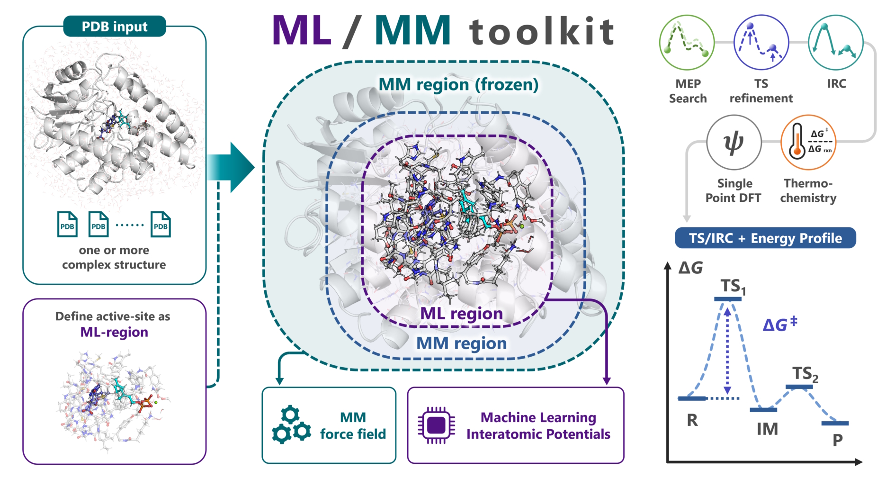

# はじめに

::::{container} p2r-intro


:::{container} p2r-intro-text
`mlmm-toolkit` は、ML/MM（機械学習 / 分子力学）法を活用し、**PDB / mmCIF 構造から酵素の反応経路候補を自動探索する** Python 製 CLI ツールキットです。

酵素のうち反応する部分（ML 領域）を機械学習原子間ポテンシャル（MLIP）で、その周りのタンパク質を Amber 力場（MM）で計算します。MLIP は DFT（密度汎関数法）の計算データを学習したニューラルネットワークで、DFT に近い精度のエネルギーと力を、ずっと少ない計算コストで求められます。

多くのケースでは、次のような **1 コマンド** で反応経路の初期案を得られます。

```bash
mlmm -i 1.R.pdb 3.P.pdb -c 'SAM,GPP,MG' -l 'SAM:1,GPP:-3'
```
:::
::::

このページでは、酵素の反応機構を調べる流れに沿って、計算化学の基本と `mlmm-toolkit` の使い方を説明します。

> **実行例:** [`examples/beza/`](https://github.com/t-0hmura/mlmm_toolkit/tree/main/examples/beza) ディレクトリに、上のコマンドで使う構造（`1.R.pdb`、`3.P.pdb`）と、GPP C6-メチル基転移酵素 BezA（[Tsutsumi et al., *Angew. Chem. Int. Ed.* 2022, 61, e202111217](https://doi.org/10.1002/anie.202111217)）を題材としたワークフロースクリプト（MEP 探索とスキャン）を用意しています。[インストール](installation.md)の後、`git clone https://github.com/t-0hmura/mlmm_toolkit && cd mlmm_toolkit/examples/beza` で取得し、その中で上のコマンドを実行してください。

---

## 全体の流れ

酵素の反応機構は、次の 7 つの手順で調べます。手順 2〜6 は、`mlmm-toolkit` の 1 つのコマンドで続けて実行できます。

| 手順 | 使うもの | `mlmm-toolkit` での扱い |
| --- | --- | --- |
| 1. 複合体の構造を用意する | 構造予測・ドッキング → MD | `mlmm-toolkit` の外 |
| 2. ML 領域と層を組む | `extract`・`mm-parm`・`define-layer` | `extract`・`define-layer` は `-c` のとき、`mm-parm` は `--parm7` が無いとき |
| 3. 反応経路を探す | `scan`・`path-opt`・`path-search` | `scan` は `-s` のとき、経路探索は TS-only モード以外 |
| 4. TS を最適化し、虚振動を確かめる | `tsopt` | `--tsopt` のとき |
| 5. R と P につながるかを確かめる | `irc` | `--tsopt` のとき |
| 6. エネルギーを比べる | `freq`・`dft` | `--tsopt` に `--thermo`・`--dft` を足したとき |
| 7. 総合的に判断する | 反応しやすい配置（NAC）の割合、障壁の最小値・中央値 | 複数のスナップショットで |

手順 2〜6 をすべて行うコマンドは次のとおりです。

```bash
mlmm -i 1.R.pdb 3.P.pdb -c 'SAM,GPP,MG' -l 'SAM:1,GPP:-3' --tsopt --thermo --dft
```

各手順は [`extract`](extract.md)、[`mm-parm`](mm-parm.md)、[`define-layer`](define-layer.md)、[`tsopt`](tsopt.md)、[`irc`](irc.md) などのサブコマンドとして単独でも実行できます。一覧は [サブコマンド](index.md#サブコマンド) にあります。

---

## 1. 複合体の構造を用意する

AlphaFold 3、Boltz-2、OpenFold3 などの構造予測や、各種のドッキングツールで、酵素と基質の複合体の構造を作ります。それを分子動力学（MD）計算にかけ、さまざまな配座のスナップショットを取り出します。MD で使った Amber のトポロジーは `--parm7` で使い回せます。1 つの構造だけで結論を出さず、複数のスナップショットで計算するのが基本です。

`mlmm-toolkit` に渡す構造では、次の 3 点に気をつけてください。

### 水素原子を付ける（必須）

入力構造には**全原子の水素が含まれている必要があります**。`all` は水素を付加しません。結晶構造など水素が欠落している構造を使用する場合は、事前に以下のツール等で付加してください。

| 推奨ツール | コマンド例 | 特徴 |
| --- | --- | --- |
| **reduce** (Richardson Lab) | `reduce input.pdb > output.pdb` | 高速で結晶構造の水素付加に広く使われる |
| **pdb2pqr** | `pdb2pqr --ff=AMBER input.pdb output.pqr` | 水素を付加し、部分電荷を割り当てる |
| **Open Babel** | `obabel input.pdb -O output.pdb -h` | 汎用的な化学情報処理ツール |
| **mm-parm --add-h** | `mlmm mm-parm -i input.pdb --add-h` | PDBFixer で `--ph`（デフォルト 7.0）に合わせて水素を付加 |

`all` は空の元素欄（77–78 列）を自分で埋めます。`extract` などのコマンドを単独で使う前には、[`add-elem-info`](add-elem-info.md) で埋めてください。PDB に代替位置（altLoc）があるときは、[`fix-altloc`](fix-altloc.md) で残基ごとに 1 つを残してください。

### 原子の並び順をそろえる（複数構造のとき）

反応物（R）や生成物（P）など複数の構造を入力する場合、**すべての構造で同一の原子が同じ順序で並んでいる必要があります**（座標値のみが異なる状態）。水素付加ツールはすべての構造に対して同一の設定で使い、PyMOL で保存するときは *Original atom order* にチェックを入れてください。反応で別の残基に移る原子も、R での残基名と原子名のままにします。同梱例では、GPP から Glu186 に移る水素は `3.P.pdb` でも `GPP 321` の `H11` です。

### 電荷を水素の数に合わせる

各リガンドには、ファイルの中の水素の数に合う電荷を与えてください。同梱例の SAM は水素が 23 個なので `SAM:1` です。22 個なら `SAM:0` になります。電荷と水素の数が合わないと、`mm-parm` は `antechamber` を実行する前に電子数のエラーで止まります。

mmCIF（`.cif`・`.mmcif`）と、PDB 形式の固定列に収まらない大きな PDB も、`all` と計算のコマンドで扱えます。単独の `mm-parm` が読むのは PDB だけです。詳しくは {ref}`mmCIF の入力 <ja-mmcif-input>` を参照してください。

---

## 2. ML 領域と層を組む

酵素は数千〜数万原子あり、全体を DFT で計算するのは現実的ではありません。そこで、反応する部分だけを精度の高い方法で、周りのタンパク質を軽い分子力学（MM）の力場で計算します。反応する部分を量子化学（QM）で計算するのが QM/MM 法で、この QM を MLIP に置き換えたものが **ML/MM** です。`mlmm-toolkit` は、2 つの計算を **ONIOM** の差し引きで合わせます。

```text
E_total = E_REAL_low + E_MODEL_high - E_MODEL_low
```

REAL は全系、MODEL は ML 領域、high は MLIP、low は MM です。全系を MM で計算し、ML 領域だけは MLIP でも計算します。ML 領域の MM のエネルギーを差し引くことで、同じ部分を二重に数えないようにします。

- **ML 領域**：`all` は、`-c` で指定した基質から `-r`（デフォルト 2.6 Å）以内に原子がある残基を ML 領域にします。
- **リンク原子**：ML 領域と MM の境目が共有結合を切るとき、ML 領域の計算では、切れた結合の ML 側を水素（リンク水素）でふさぎます。リンク水素は切れた結合に沿って置かれ、かかった力は両側の原子に分けて返されます。`mlmm-toolkit` は自動でリンク水素を置きます（[ML/MM 計算機](mlmm-calc.md#リンク原子の再分配)）。
- **MM の層**：`mm-parm` で全系の Amber トポロジーを作り、`define-layer` で ML 領域の外の原子を、最適化で動く可動 MM と、その外で固定される固定 MM に分けます。層は PDB の B-factor 欄に書きます。

詳しくは [ML 領域と層の組み方](model-setup.md) を参照してください。

**クラスターモデルとの違い**：反応に関わる部分だけを切り出すクラスターモデルでは、タンパク質の形と環境を保つために、反応に直接関わらない残基まで含めた大きなモデルが要ります。ML/MM では周りのタンパク質を MM として残すので、ML 領域を反応する部分だけに小さくしやすく、クラスターモデルよりも計算が軽くなる場合があります。同梱例では、デフォルトの ML 領域は 632 原子で、主鎖の原子を MM に回すと 397 原子、残基を自分で選ぶと 129 原子になります（[ML 領域を小さくする](model-setup.md#ml-領域を小さくする)）。

**ML 領域の大きさ**：QM/MM の QM 領域の大きさを変えた COMT（カテコール *O*-メチル基転移酵素）の研究では、基質から近い順に残基を足していくと、約 500〜600 原子で活性化エネルギーがほぼ一定になりました（[Kulik et al., *J. Phys. Chem. B* 2016, 120, 11381](https://doi.org/10.1021/acs.jpcb.6b07814)）。障壁の値を詰めるときは、ML 領域を広げても結果が変わらないかを確かめてください。反応に関わる残基が入っていないときは `-r` を広げるか、`-c` や `--selected-resn` に足してください（{ref}`モデルを広げる <ja-model-setup-larger>`）。

---

## 3. 反応経路を探す

反応物（R）と生成物（P）の構造を最適化し、R と P をつなぐ最小エネルギー経路（MEP）を探します。経路のなかで最もエネルギーの高い点が、遷移状態（TS）の候補になります。この手順は、小分子の反応機構解析と同じです。

入力の与え方は 3 通りです。

| 実行モード | 入力条件 | 主な動作 |
| --- | --- | --- |
| **Endpoint モード** | 2 つ以上の PDB（`-i R.pdb P.pdb`） | 各構造から ML 領域と層を作り、その間の MEP を探索 |
| **Scan-list モード** | 1 つの PDB ＋ `--scan-lists`（`-s`） | 指定した距離・角度・二面角を段階的に変化させて経路を生成 |
| **TS-only モード** | 1 つの PDB ＋ `--tsopt` | MEP 探索をスキップし、TS 候補の最適化・IRC を直接実行 |

> **注意:** 単一構造のみを入力する場合、`--scan-lists/-s` または `--tsopt` のいずれかの指定が必須です。

---

## 4. TS を最適化し、虚振動を確かめる

TS は、反応の進む方向にだけエネルギーが極大で、ほかのすべての方向には極小になっている点（1 次の鞍点）です。この点で振動数を計算すると、反応の進む方向の 1 つだけが虚数の振動数（虚振動）になります。虚振動が 0 なら極小、2 つ以上なら TS ではありません。

TS 最適化が成功すると、反応モードの虚振動が 1 つ出ます。その虚振動が、狙った結合の組み換えの動きになっていることも確かめてください。

**固定した原子と PHVA**：固定 MM のように原子を固定すると、構造は、固定した原子の方向にはエネルギーの極小にも鞍点にもなっていません。全原子で振動数を計算すると、固定の影響で本来は無い虚振動が出ることがあります。そこで、動ける原子だけの Hessian（エネルギーの 2 階微分）で振動数を求めます。これを部分 Hessian 振動解析（PHVA）と呼び、`mlmm-toolkit` の `freq` は ML 領域と可動 MM の原子で行います。

---

## 5. R と P につながるかを確かめる

虚振動が 1 つでも、その TS が狙った R と P の間にあるとは限りません。IRC（固有反応座標）で TS から両側へ坂を下り、たどり着いた先が狙った R と P であることを確かめます。`mlmm-toolkit` は IRC の両端をさらに最適化するので、IRC が途中で止まっても、端点の最適化で狙った R と P に着けば、その結果は使えます。

---

## 6. エネルギーを比べる

`--thermo` で振動解析から熱化学補正（ギブズエネルギー）を、`--dft` で DFT の一点計算を加え、活性化エネルギー（R → TS）と反応エネルギー（R → P）を求めます。

実行が終わると、`-o` の出力ディレクトリに次のファイルができます。デフォルトは `./result_all/` です。主なファイルは [出力ディレクトリのレイアウト](output-layout.md)、`summary.json` のすべての欄は {ref}`JSON 出力の一覧 <ja-summary-json-path-search-all>` にあります。

| 出力ファイル / フォルダ | 内容 |
| --- | --- |
| `summary.log` | テキスト形式のサマリー（ディレクトリ構成、各段階の進行状況） |
| `summary.json` | 機械可読形式の結果（反応障壁、各状態のエネルギー、結合変化） |
| `energy_diagram_*.png` | 生成されたエネルギープロファイル図（電子エネルギー / Gibbs 補正） |
| `mep_trj.pdb` / `mep_trj.cif` | 最小エネルギー経路（MEP）のアニメーション軌跡ファイル |
| `ml_region.pdb`、`mm_parm/`、`layered/` | ML 領域、全系の Amber トポロジー、層を書き込んだ全系の PDB。`--model-pdb` と `--parm7` で使い回せる |
| `segments/seg_NN/` | 反応セグメントごとの詳細結果（最適化された R/TS/P 構造、IRC 軌跡など。`--tsopt` のとき） |

端末の出力の最後のほうにある `====== Pipeline summary ======` の下の `Scientific status:` の行（`summary.json` の `scientific_status`）は、指定した段がすべて収束すると `success`、そうでなければ `partial` か `failed` になり、理由は `scientific_status_reasons` に出ます。TS の n_imag が 1 か、端点が狙った R と P かは自分で確かめてください。開くファイルは各クイックスタートにあります。

---

## 7. 総合的に判断する

1 つの経路だけで結論は出せません。MD で反応しやすい配置（反応する原子どうしが近く、反応しやすい向きにある配置。near-attack conformation、NAC）が現れる割合や、複数のスナップショットで得られた反応障壁の最小値・中央値などをあわせて見て、反応機構が妥当かを検討します。

結果は、初期構造とモデルの組み方に大きく左右されます。構造やモデルを変えて何度も計算し直す試行錯誤はどうしても必要です。`mlmm-toolkit` は手順 2〜6 を自動化し、MLIP で速く計算するので、この試行錯誤に向いています。

---

## その先へ

`mlmm-toolkit` の強みは、多くの基質や変異体をまとめて計算するハイスループット計算、実験値の裏付け、試行錯誤に使えることです。

MLIP で全系を扱う MD や ML/MM MD を行うと、酵素全体のダイナミクスも見られます。ただし、MD は、ポテンシャルエネルギー曲面の上で行うクラスターモデルや ML/MM の計算より計算コストが高いので、`mlmm-toolkit` で反応機構を確かめてから行うのもよい方法です。

MLIP は比較的新しい技術なので、計算だけで論文を書くときは、しばらくは DFT の計算が求められると思います。`mlmm-toolkit` は DFT のバックエンドも備えているので、ML 領域を DFT で計算する QM/MM（DFT/MM）計算まで、同じツールの中で完結できます（[MLIP の TS を DFT で確かめる](dft-backend.md)）。ぜひ使ってみてください。

---

## クイックスタート導線

環境構築の詳細は [インストールガイド](installation.md) を参照してください。

* **Web ブラウザで手軽に試す**: [Colab GUI ノートブック](https://colab.research.google.com/github/t-0hmura/mlmm_toolkit/blob/main/examples/mlmm_colab.ipynb)（3D で ML 領域を選択）
* **複数の PDB 構造から始める**: [クイックスタート: `mlmm all`](quickstart-all.md)
* **1 つの PDB 構造からスキャンで探索する**: [クイックスタート: `mlmm all --scan-lists`](quickstart-scan.md)
* **TS 候補構造を最適化・検証する**: [クイックスタート: TS-only モード](quickstart-tsopt.md)

---

## コマンドの基本構成

インストール後は `mlmm` コマンドが利用できます。サブコマンドを省略した場合、自動的に `all` が呼び出されます。

```bash
# 以下の 2 つは同一の処理を行います
mlmm [OPTIONS]...
mlmm all [OPTIONS]...
```

### all と個別のコマンドの使い分け

* **`all` を使う場面**: モデルの構築 → MEP 探索 → TS 最適化と IRC → 振動数と DFT までを 1 コマンドで実行したいとき、または手探りの段階で出力の管理を 1 コマンドに任せたいとき。
* **個別のコマンドを使う場面**: 各ステージを 1 つずつ実行し、結果を確かめてから次に進みたいとき。複雑な反応では、一括実行よりもステップごとの実行が有効なことが多くあります。独自の手順や、前の計算の parm7 と層付き PDB を使い回す計算にも向きます。

個別の ML/MM のコマンドには、全系のトポロジー（`--parm7`）と ML 領域（`--model-pdb`、`--model-indices`、入力の B-factor の層のいずれか）が必要です。`all` はどちらも自動で作ります。`-q` は全系ではなく ML 領域の電荷です。詳しくは {ref}`ML/MM の共通オプション <ja-mlmm-options>` を参照してください。

---

## 基本的な CLI オプション

| オプション | 引数の例 | 説明 |
| --- | --- | --- |
| `-i, --input` | `1.R.pdb 3.P.pdb` | 入力構造ファイル（PDB / mmCIF）。複数指定可能 |
| `-c, --center` | `'SAM,GPP'` / `'A:SAM:123'` | 抽出中心（基質残基名・残基 ID・PDB ファイル）。その周りを ML 領域として切り出す。省略時は切り出しを行わずに構造全体を使い、ML 領域は B-factor の層か `--model-pdb` から取る（どちらも無いとエラー） |
| `-l, --ligand-charge` | `'SAM:1,GPP:-3'` | リガンドごとの形式電荷マッピング（標準残基とイオンの電荷は自動で数えます） |
| `-q, --charge` | `-2` | 全系ではなく ML 領域の総電荷（自動判定を上書きする場合に指定） |
| `-m, --multiplicity` | `1` | スピン多重度（デフォルト: `1`、一重項） |
| `--parm7` | `real.parm7` | 使い回す全系の Amber トポロジー（前の計算や、入力のスナップショットを作った MD のもの）。指定すると `mm-parm` を省略 |
| `--model-pdb` | `ml_region.pdb` | ML 領域を表す PDB。`-c` や B-factor の層より優先 |
| `--tsopt/--no-tsopt` | （フラグ） | TS 最適化と IRC 計算を有効化 |
| `--thermo/--no-thermo` | （フラグ） | 振動解析と QRRHO（準剛体ローター・調和振動子）モデルによる熱化学補正を実行（`--tsopt` と併用） |
| `--dft/--no-dft` | （フラグ） | 得られた構造に対して一点 DFT 計算を実行（`--tsopt` と併用） |
| `-b, --backend` | `uma` / `orb` / `mace` | ML 領域に使うバックエンドを指定（デフォルト: `uma`。`dft` も選択可能） |

構文ルールの詳細は [共通オプションと残基・原子の指定](cli-conventions.md)、全オプションは [`all` のオプションの一覧（英語のみ）](../reference/commands/all.md) を参照してください。

---

## AI エージェント連携（Skills）

AI エージェント（Claude Code、Codex、Cursor など）向けの手順書を `skills/` ディレクトリに同梱しています。

CLI サブコマンド、構造の入出力、バックエンドの導入、TS 探索の方針、HPC での実行が書かれています。`skills/` をエージェントに読み込ませることで、エージェントを通じた自然言語指示による計算実行・解析が可能になります。配置場所とスキルの一覧は [`skills/README.md`](https://github.com/t-0hmura/mlmm_toolkit/blob/main/skills/README.md) を参照してください。MCP のクライアントからコマンドをツールとして呼ぶ方法は [MCP サーバー](mcp_server.md) にあります。

---

## トラブルシューティングとサポート

実行中にエラーが発生した場合は、以下のドキュメントを参照してください。

* {ref}`トラブルシューティング <ja-troubleshooting-quick-table>`: エラー症状別の対処法と、インストールや環境起因の不具合の解決手順
* [MLIP バックエンド](backends.md): バックエンドの選び方と並列ワーカーの使い方。GPU メモリ、デバイスの設定、クラスターのジョブスクリプトは [デバイス設定 & HPC セットアップ](device-hpc.md)

コマンドの全オプションを確認したい場合は、ヘルプオプションを利用してください。

```bash
mlmm <subcommand> --help
mlmm all --help-advanced
```

解決しない問題やバグの報告は、[GitHub Issues](https://github.com/t-0hmura/mlmm_toolkit/issues) にて受け付けています。
