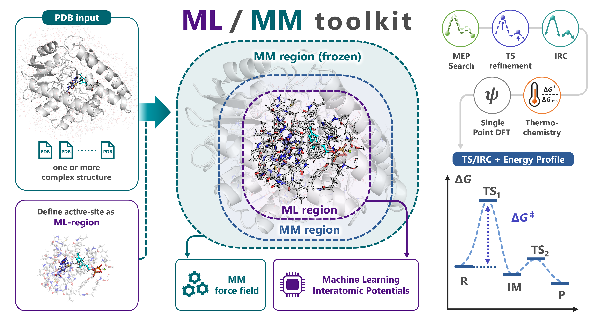

# はじめに



`mlmm-toolkit` は、ML/MM（機械学習 / 分子力学）法を活用し、**PDB / mmCIF 構造から酵素の反応経路候補を自動探索する** Python 製 CLI ツールキットです。

ML/MM は、QM/MM の QM を機械学習原子間ポテンシャル（MLIP）に置き換えた方法です。MLIP は DFT（密度汎関数法）の計算データを学習したニューラルネットワークで、DFT レベルのポテンシャルエネルギー曲面をごくわずかな計算コストで近似します。酵素のうち反応する部分（ML 領域）を MLIP で、その周りのタンパク質を Amber 力場（MM）で計算し、両者を ONIOM の差し引きで合わせます。

```text
E_total = E_REAL_low + E_MODEL_high - E_MODEL_low
```

REAL は全系、MODEL は ML 領域、high は MLIP、low は MM のバックエンドです。全系を MM で、ML 領域を MLIP と MM の両方で計算し、ML 領域の MM のエネルギーを差し引くことで二重に数えないようにします。ML 領域が共有結合を切る所は、リンク水素でふさぎます。

MM の原子は 2 つの層に分かれます。Movable-MM は最適化で動き、その外の Frozen-MM は固定されます。層は PDB の B-factor 欄に書きます。層の詳細は [ML 領域と層の組み方](model-setup.md)、エネルギー・力・Hessian の計算は [ML/MM 計算機](mlmm-calc.md) を参照してください。

多くのケースでは、次のような **1 コマンド** で反応経路の初期案を得られます。

```bash
mlmm -i 1.R.pdb 3.P.pdb -c 'SAM,GPP,MG' -l 'SAM:1,GPP:-3'
```

---

さらに `--tsopt --thermo --dft` を追加すると、**最小エネルギー経路（MEP）探索 → 遷移状態（TS）最適化 → 固有反応座標（IRC） → 振動解析・熱化学補正 → DFT 一点計算** までを一貫して自動実行できます。

```bash
mlmm -i 1.R.pdb 3.P.pdb -c 'SAM,GPP,MG' -l 'SAM:1,GPP:-3' --tsopt --thermo --dft
```

---

> **実行例:** [`examples/beza/`](https://github.com/t-0hmura/mlmm_toolkit/tree/main/examples/beza) ディレクトリに、上のコマンドで使う構造（`1.R.pdb`、`3.P.pdb`）と、GPP C6-メチル基転移酵素 BezA（[Tsutsumi et al., *Angew. Chem. Int. Ed.* 2022, 61, e202111217](https://doi.org/10.1002/anie.202111217)）を題材としたワークフロースクリプト（MEP 探索とスキャン）を用意しています。[インストール](installation.md)の後、`git clone https://github.com/t-0hmura/mlmm_toolkit && cd mlmm_toolkit/examples/beza` で取得し、その中で上のコマンドを実行してください。

## 主な用途

* DFT の QM/MM では検証に時間がかかる、酵素全体を含む系での**反応機構解析の試行錯誤**
* QM/MM 計算に向けた**初期構造の作成**（全系の反応物・TS・生成物。[`oniom-export`](oniom-export.md) で Gaussian ONIOM や ORCA QM/MM の入力にできます）
* 基質バリアントや酵素変異体にわたる**反応経路の大量計算**

## 主な自動化機能

入力として「(1) 反応順に並べた複数の PDB 構造（R → … → P）」「(2) 単一構造 ＋ スキャン指定」「(3) 単一構造 ＋ TS 最適化指定」のいずれかを与えることで、以下を自動処理します。

1. **ML 領域**: 指定した基質周辺から活性部位（バインディングポケット）を切り出し、ML 領域とする
2. **MM のトポロジーと層**: `mm-parm`（AmberTools）で全系の Amber トポロジーを作り、`define-layer` で ML・Movable-MM・Frozen-MM の層を割り当てる
3. **最小エネルギー経路（MEP）探索**: Growing String Method (GSM) や Direct Max Flux (DMF) による経路探索
4. **高精度検証**: 遷移状態（TS）の構造最適化、IRC 計算、振動解析、DFT 一点計算

ML 領域の計算にはデフォルトの **UMA**（Meta）のほか、`-b/--backend` オプションで **ORB**、**MACE**、**AIMNet2** も選択可能です（[MLIP バックエンド](backends.md) を参照）。

MLIP/MM で妥当な経路が見つかったら、その TS をそのまま DFT/MM での TS 構造最適化にもっていくことにも `mlmm-toolkit` は対応しています。TS 最適化 → IRC → 端点の最適化 → 振動数計算のワークフローを、GPU4PySCF を用いることで GPU で高速化された DFT 計算により実行可能です。詳しくは [MLIP の TS を DFT で確かめる](dft-backend.md) を参照してください。

> 自分で組んだモデルをそのまま使うときは、`-c` を省きます（[ML 領域と層の組み方](model-setup.md#自分で組んだモデルを使う)）。

---

## ワークフローとパイプライン

### パイプラインの流れ

全工程を一括実行する `all` サブコマンド（デフォルト動作）は、以下のステージを順次実行します。

```text
入力構造（PDB / mmCIF）
  │
  ▼
[extract] 抽出ステージ: -c 指定時のみ基質周辺から ML 領域を切り出し
  │
  ▼
[mm-parm] MM トポロジー: 全系の Amber parm7/rst7 を作成（--parm7 指定時は省略）
  │
  ▼
[define-layer] 層の割り当て: ML / Movable-MM / Frozen-MM の層を B-factor 欄に記入
  │
  ▼
[scan] スキャンステージ: -s 指定時のみ距離・角度・二面角の段階的スキャンを実施
  │
  ▼
[path-opt / path-search] 経路探索: TS-only モード以外で MEP（最小エネルギー経路）を探索
  │
  ▼
[tsopt] TS 最適化: --tsopt 指定時のみ遷移状態を精密化
  │
  ▼
[irc] IRC 計算: --tsopt 指定時のみ固有反応座標を追跡し、端点を最適化
  │
  ▼
[freq] 振動解析: --tsopt --thermo 指定時のみ熱化学補正を計算
  │
  ▼
[dft] DFT 一点計算: --tsopt --dft 指定時のみ DFT/MM エネルギーを算出
```

各ステージは単独のサブコマンドとしても実行可能です。

実行の最後に端末に `Scientific status: success` と出れば、求めた段はすべて収束しています。TS 最適化が成功すると、反応モードの虚振動が 1 つ出ます。IRC が収束しなくても、端点の最適化で狙った R と P に着けば、その結果は使えます。

---

## クイックスタート導線

環境構築の詳細は [インストールガイド](installation.md) を参照してください。

* **Web ブラウザで手軽に試す**: [Colab GUI ノートブック](https://colab.research.google.com/github/t-0hmura/mlmm_toolkit/blob/main/examples/mlmm_colab.ipynb)（3D で ML 領域を選択）
* **複数の PDB 構造から始める**: [クイックスタート: `mlmm all`](quickstart-all.md)
* **1 つの PDB 構造からスキャンで探索する**: [クイックスタート: `mlmm all --scan-lists`](quickstart-scan.md)
* **TS 候補構造を最適化・検証する**: [クイックスタート: TS-only モード](quickstart-tsopt.md)

---

## コマンドの基本構成

インストール後は `mlmm` コマンドが利用できます。サブコマンドを省略した場合、自動的に `all` が呼び出されます。

```bash
# 以下の 2 つは同一の処理を行います
mlmm [OPTIONS]...
mlmm all [OPTIONS]...
```

### 入力モードの選び方

| 実行モード | 入力条件 | 主な動作 |
| --- | --- | --- |
| **複数構造 MEP 探索** | 2 つ以上の PDB（`-i R.pdb P.pdb`） | 各構造から ML 領域と層を作り、その間の MEP を探索 |
| **単一構造 ＋ スキャン** | 1 つの PDB ＋ `--scan-lists`（`-s`） | 指定した距離・角度・二面角を段階的に変化させて経路を生成 |
| **TS-only モード** | 1 つの PDB ＋ `--tsopt` | MEP 探索をスキップし、TS 候補の最適化・IRC を直接実行 |

> **注意:** 単一構造のみを入力する場合、`--scan-lists/-s` または `--tsopt` のいずれかの指定が必須です。

### all と個別のコマンドの使い分け

* **`all` を使う場面**: モデルの構築 → MEP 探索 → TS 最適化と IRC → 振動数と DFT までを 1 コマンドで実行したいとき、または手探りの段階で出力の管理を 1 コマンドに任せたいとき。
* **個別のコマンドを使う場面**: 各ステージを 1 つずつ実行し、結果を確かめてから次に進みたいとき。複雑な反応では、一括実行よりもステップごとの実行が有効なことが多くあります。独自の手順や、前の計算の parm7 と層付き PDB を使い回す計算にも向きます。

個別の ML/MM のコマンドには、全系のトポロジー（`--parm7`）と ML 領域（`--model-pdb`、`--model-indices`、入力の B-factor の層のいずれか）が必要です。`all` はどちらも自動で作ります。`-q` は全系ではなく ML 領域の電荷です。詳しくは {ref}`ML/MM の共通オプション <ja-mlmm-options>` を参照してください。

---

## 基本的な CLI オプション

| オプション | 引数の例 | 説明 |
| --- | --- | --- |
| `-i, --input` | `1.R.pdb 3.P.pdb` | 入力構造ファイル（PDB / mmCIF）。複数指定可能 |
| `-c, --center` | `'SAM,GPP'` / `'A:SAM:123'` | 抽出中心（基質残基名・残基 ID・PDB ファイル）。その周りを ML 領域として切り出す。省略時は切り出しを行わずに構造全体を使い、ML 領域は B-factor の層か `--model-pdb` から取る（どちらも無いとエラー） |
| `-l, --ligand-charge` | `'SAM:1,GPP:-3'` | リガンドごとの形式電荷マッピング（標準残基とイオンの電荷は自動で数えます） |
| `-q, --charge` | `-2` | 全系ではなく ML 領域の総電荷（自動判定を上書きする場合に指定） |
| `-m, --multiplicity` | `1` | スピン多重度（デフォルト: `1`、一重項） |
| `--parm7` | `real.parm7` | 使い回す全系の Amber トポロジー（前の計算や、入力のスナップショットを作った MD のもの）。指定すると `mm-parm` を省略 |
| `--model-pdb` | `ml_region.pdb` | ML 領域を表す PDB。`-c` や B-factor の層より優先 |
| `--tsopt/--no-tsopt` | （フラグ） | TS 最適化と IRC 計算を有効化 |
| `--thermo/--no-thermo` | （フラグ） | 振動解析と QRRHO（準剛体ローター・調和振動子）モデルによる熱化学補正を実行（`--tsopt` と併用） |
| `--dft/--no-dft` | （フラグ） | 得られた構造に対して一点 DFT 計算を実行（`--tsopt` と併用） |
| `-b, --backend` | `uma` / `orb` / `mace` | ML 領域に使うバックエンドを指定（デフォルト: `uma`。`dft` も選択可能） |

構文ルールの詳細は [共通オプションと残基・原子の指定](cli-conventions.md)、全オプションの一覧は [`all` の CLI リファレンス](../reference/commands/all.md) を参照してください。

---

## 入力構造に関する重要事項

### 1. 水素原子の付加（必須）

入力構造には**全原子の水素が含まれている必要があります**。`all` は水素を付加しません。結晶構造など水素が欠落している構造を使用する場合は、事前に以下のツール等で付加してください。

| 推奨ツール | コマンド例 | 特徴 |
| --- | --- | --- |
| **reduce** (Richardson Lab) | `reduce input.pdb > output.pdb` | 高速で結晶構造の水素付加に広く使われる |
| **pdb2pqr** | `pdb2pqr --ff=AMBER input.pdb output.pqr` | 水素を付加し、部分電荷を割り当てる |
| **Open Babel** | `obabel input.pdb -O output.pdb -h` | 汎用的な化学情報処理ツール |
| **mm-parm --add-h** | `mlmm mm-parm -i input.pdb --add-h` | PDBFixer で `--ph`（既定 7.0）に合わせて水素を付加 |

`all` は空の元素欄（77–78 列）を自分で埋めます。`extract` などのコマンドを単独で使う前には、[`add-elem-info`](add-elem-info.md) で埋めてください。PDB に代替位置（altLoc）があるときは、[`fix-altloc`](fix-altloc.md) で残基ごとに 1 つを残してください。

### 2. 原子の並び順の一致（複数構造入力時）

反応物（R）や生成物（P）など複数の構造を入力する場合、**すべての構造で同一の原子が同じ順序で並んでいる必要があります**（座標値のみが異なる状態）。水素付加ツールはすべての構造に対して同一の設定で使い、PyMOL で保存するときは *Original atom order* にチェックを入れてください。反応で別の残基に移る原子も、R での残基名と原子名のままにします。同梱例では、GPP から Glu186 に移る水素は `3.P.pdb` でも `GPP 321` の `H11` です。

### 3. 電荷を水素の数に合わせる

各リガンドには、ファイルの中の水素の数に合う電荷を与えてください。同梱例の SAM は水素が 23 個なので `SAM:1` です。22 個なら `SAM:0` になります。電荷と水素の数が合わないと、`mm-parm` は `antechamber` を実行する前に電子数のエラーで止まります。

mmCIF（`.cif`・`.mmcif`）と、PDB 形式の固定列に収まらない大きな PDB も、`all` と計算のコマンドで扱えます。単独の `mm-parm` が読むのは PDB だけです。詳しくは {ref}`mmCIF の入力 <ja-mmcif-input>` を参照してください。

---

## 出力ファイルの構成

実行完了後、出力ディレクトリ（既定は `./result_all/`、`-o` で変更）に以下のファイル群が生成されます。主なファイルは [出力ディレクトリのレイアウト](output-layout.md)、`summary.json` の欄は [JSON 出力リファレンス](json-output.md) にあります。

| 出力ファイル / フォルダ | 内容 |
| --- | --- |
| `summary.log` | テキスト形式のサマリー（ディレクトリ構成、各段階の進行状況） |
| `summary.json` | 機械可読形式の結果（反応障壁、各状態のエネルギー、結合変化） |
| `energy_diagram_*.png` | 生成されたエネルギープロファイル図（電子エネルギー / Gibbs 補正） |
| `mep_trj.pdb` / `mep_trj.cif` | 最小エネルギー経路（MEP）のアニメーション軌跡ファイル |
| `ml_region.pdb`、`mm_parm/`、`layered/` | ML 領域、全系の Amber トポロジー、層を書き込んだ全系の PDB。`--model-pdb` と `--parm7` で使い回せる |
| `segments/seg_NN/` | 反応セグメントごとの詳細結果（最適化された R/TS/P 構造、IRC 軌跡など。`--tsopt` のとき） |

端末の出力の最後のほうにある `====== Pipeline summary ======` の下の `Scientific status:` の行（`summary.json` の `scientific_status`）は、求めた段がすべて収束すると `success`、そうでなければ `partial` か `failed` になり、理由は `scientific_status_reasons` に出ます。TS の n_imag が 1 か、端点が狙った R と P かは自分で確かめてください。開くファイルは各クイックスタートにあります。

---

## AI エージェント連携（Skills）

`mlmm-toolkit` には、AI エージェント（Claude Code、Codex、Cursor など）向けの設定指示書が `skills/` ディレクトリに同梱されています。

CLI サブコマンド、構造の入出力、バックエンドの導入、TS 探索の方針、HPC での実行が書かれています。`skills/` をエージェントに読み込ませることで、エージェントを通じた自然言語指示による計算実行・解析が可能になります。配置場所とスキルの一覧は [`skills/README.md`](https://github.com/t-0hmura/mlmm_toolkit/blob/main/skills/README.md) を参照してください。MCP のクライアントからコマンドをツールとして呼ぶ方法は [mlmm MCP サーバー](mcp_server.md) にあります。

---

## トラブルシューティングとサポート

実行中にエラーが発生した場合は、以下のドキュメントを参照してください。

* [トラブルシューティング](troubleshooting.md): エラー症状別の対処法と、インストールや環境起因の不具合の解決手順
* [MLIP バックエンド](backends.md): バックエンドの選び方と並列ワーカーの使い方。GPU メモリ、デバイスの設定、クラスターのジョブスクリプトは [デバイス設定 & HPC セットアップ](device-hpc.md)

コマンドの全オプションを確認したい場合は、ヘルプオプションを利用してください。

```bash
mlmm <subcommand> --help
mlmm all --help-advanced
```

解決しない問題やバグの報告は、[GitHub Issues](https://github.com/t-0hmura/mlmm_toolkit/issues) にて受け付けています。
